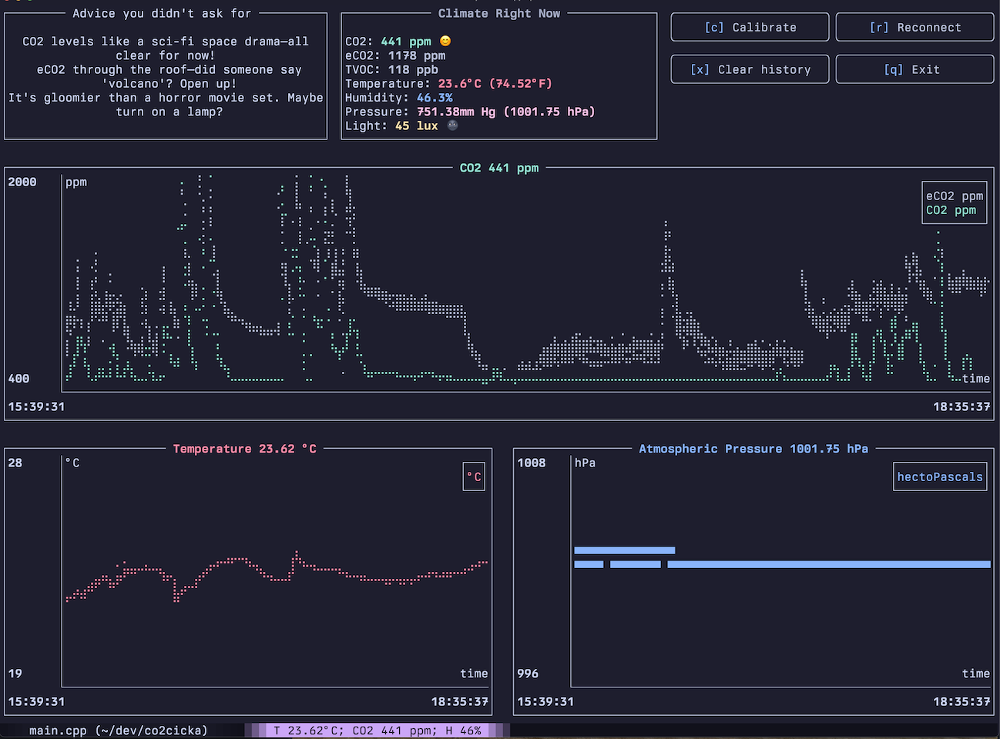

# CO2nsole

Welcome to CO2nsole, an innovative open-source project aimed at providing an environmental monitoring device that measures CO2 levels and all the other microclimate information in a private open and efficient way. This repository contains all the resources necessary to build the CO2nsole device, as well as a CLI library for a Text-based User Interface (TUI) library, making it highly embeddable into other projects or targets.

| Device                      | Software                           |
| --------------------------- | ---------------------------------- |
|  |  |

## Features

- **DIY Build Guide**: Step-by-step instructions to build your own CO2nsole device.
- **CLI for TUI**: Intuitive command-line interface to interact with the device via a text-based user interface.
- **Embeddable Solutions**: Flexible design for integrating CO2nsole functionality into different target environments.
- **Real-Time Monitoring**: Monitor CO2 levels in real-time with accurate and responsive readings.
- **Open-Source**: Freedom to modify, enhance, and distribute the application as per your needs.

## Building

You can have 2 versions of the CO2nsole device. The required minimum components for the basic no-battery versions are:

| Sensor                     | Description                                                                                                                                                                                                  |
| -------------------------- | ------------------------------------------------------------------------------------------------------------------------------------------------------------------------------------------------------------ |
|    | The ESP32 is a versatile microcontroller featuring dual-core CPUs and built-in Wi-Fi and Bluetooth capabilities, having enough power to maintain all the sensors work and the BLE and Network based syncing. |
|   | The MH-Z19 is a carbon dioxide sensor that measures CO2 levels in the air using non-dispersive infrared (NDIR) technology, ideal for indoor air quality monitoring.                                          |
|  | The CCS811 is an air quality sensor capable of detecting volatile organic compounds (VOCs) and CO2, making it suitable for monitoring indoor environments.                                                   |
|  | The BH1750 is a digital light intensity sensor that provides measurements in lux, which helps in adjusting lighting conditions in applications like smart buildings.                                         |

Checkout the following sketch and connect everything as shown in this sketch:


For the initial build (no battery) you can connect the 5v directly the the esp32 5v sensor.

Make sure that css811 and bh1750 share the same I2C bus (GPIO21/22). While the MH-Z19 is connected to the 1 hardware UART port of the ESP32 (GPIO16/17).

### Firmware

Make sure that it is required to install PlatformIO on your computer. You can follow the instructions in the [official documentation](https://docs.platformio.org/en/latest/core/installation.html) to install it.

Flashing the firmware is as simple as

```bash
cd core
pio run -t upload
pio device monitor
```

If everything works correctly your device will start printing out the measurements in the serial monitor.

## Building the CLI app

You can build and run the CLI using rust toolchain by running the following commands:

```bash
cd cli
cargo run --release
```

Build and link the binary to your path using

```bash
cd cli
sh link.sh
# this binary will be located in /usr/local/bin and will be available globally
co2
```

This may be needed to implement custom trend reactions for the APP. Checkout the ./cli/src/reactions.rs file for an example and documentation on custom reactions.

Or it is also possible to install the CLI using cargo:

```bash
cargo install --locked co2nsole
```

#### MacOS note

It is required to run Bluetooth for your terminal emulator. You can do this by going to System Preferences -> Security & Privacy -> Privacy -> Bluetooth and checking your terminal emulator.

## Adding battery

For better stability, it is required to install the batter as the CO2 sensor is designed to be always on for better calibration and more stable results. Here is a an schema of the battery that might be used:

### Hardware

| Device                     | Description                                                                                                                        |
| -------------------------- | ---------------------------------------------------------------------------------------------------------------------------------- |
| 5V 3A DC-DC Step-Up Module | Amplifies input voltage up to 5v required for the MH-Z19 sensor.                                                                   |
| AILAVI 0503V3              | A module known for its precision and efficiency, widely used in diverse electronic applications for reiable performance.           |
| TPS63020                   | A buck-boost converter that provides a stable 5V output from a 3.7V LiPo battery, ideal for portable and battery-powered projects. |
| 18650 LiPo Battery         | Actually any batter with appropriate voltage will fit correctly, just make sure that the input current is in the safe range.       |
| YR-1006 single bond button | A button to turn on/off the device .                                                                                               |

> Note On the AILAVI 0503V3 you can change the controlling register for higher charging current. I recommend to change it to the 135KOhm for the charging current of 1A.


